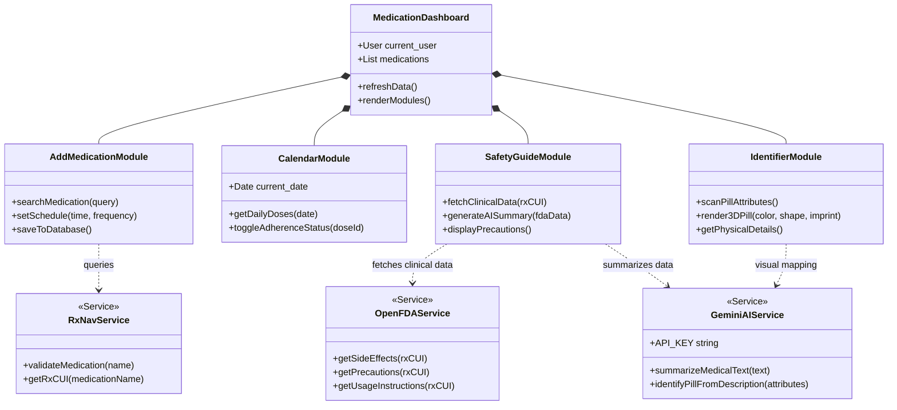
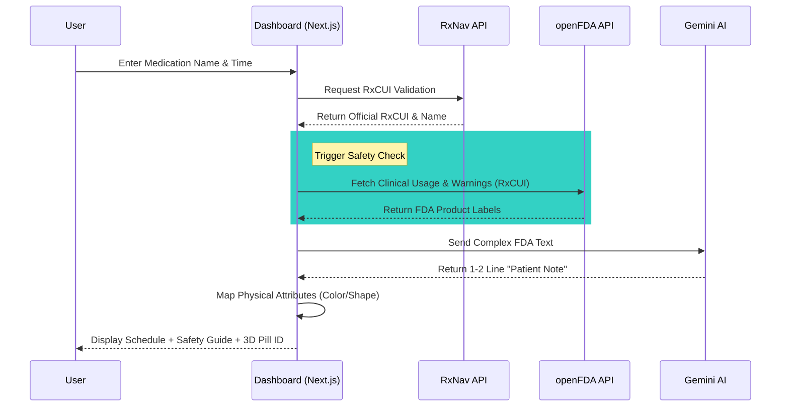

# 💊PillScheduler

💊PillScheduler is an intelligent, high-performance medication management dashboard that bridges the gap between technical clinical data and patient-friendly care. It integrates official NIH RxNav, openFDA, and Google Gemini AI to provide a seamless experience for medication management.

## 🌟 Key Features
🌟 Dashboard Overview
Based on the core interface, the platform is divided into four high-impact modules:
This README has been updated to reflect the specific logic of your four core modules and how they interact with clinical APIs.

## 💊 PillScheduler
PillReminder is a high-performance clinical dashboard designed to simplify complex medication regimens. It bridges the gap between official medical databases and daily patient care using a modern, accessible interface.

## 🌟 Dashboard Modules
➕ 1. Add New Medication
- Precision Scheduling: Define exactly what time a medication needs to be taken.
- Timezone Enforcement: Utilizes America/New_York (ET) logic to ensure scheduled times remain consistent across devices.

📅 2. Medication Calendar
- Daily View: A focused interface dedicated to viewing your scheduled medications for the current day.
- Adherence Tracking: Monitor which doses are pending or completed in a real-time grid.

🛡️ 3. Safety Guide
- Clinical Insights: Leverages the openFDA API to provide detailed information about your daily medications.
- Safety First: Displays critical precautions and clinical usage data to prevent adverse reactions.

✨ 4. Medication Identifier
- Physical Verification: Provides specific details regarding the color, shape, and imprint of medications.
- Visual Pill ID: Generates digital 3D-styled representations to help users visually confirm they are taking the correct pill.
- AI Summaries: Uses Gemini 1.5 Flash to find visual features like color and imprint for the pills.

🔎 5.Search Functionality
- Firebase Querying: Efficiently search and filter your personalized medication records stored in Firestore.
- Historical Retrieval: Instantly locate past medications by querying the database for historical entries and archived schedules.

## 🛠️ **Technical Stack**
- **Framework:** [Next.js 15](https://nextjs.org/docs) (App Router)
- **AI Engine:** [Google Gemini API](https://developers.google.com/ai)
- **Data Sources:**
  - [RxNav REST API](https://www.nlm.nih.gov/research/umls/rxnorm/index.html)
  - [openFDA API](https://open.fda.gov/apis/)
- **Styling:** [Tailwind CSS](https://tailwindcss.com/)
- **Icons:** [Lucide React](https://github.com/lucide-icons/lucide)

## 🚀 **Getting Started**

### Prerequisites
- **Node.js** 18.17 or later
- A **Google AI Studio API Key** to access the Gemini AI functionality.

### Installation
1. **Clone the repository:**

   ```bash
   git clone (https://github.com/Sumiksh/PillReminders.git)


### 🏗️ PillScheduler Class Architecture
This diagram illustrates how the frontend components interact with the backend services and external APIs to manage medication data.



### 🏗️ Sequence Diagram
